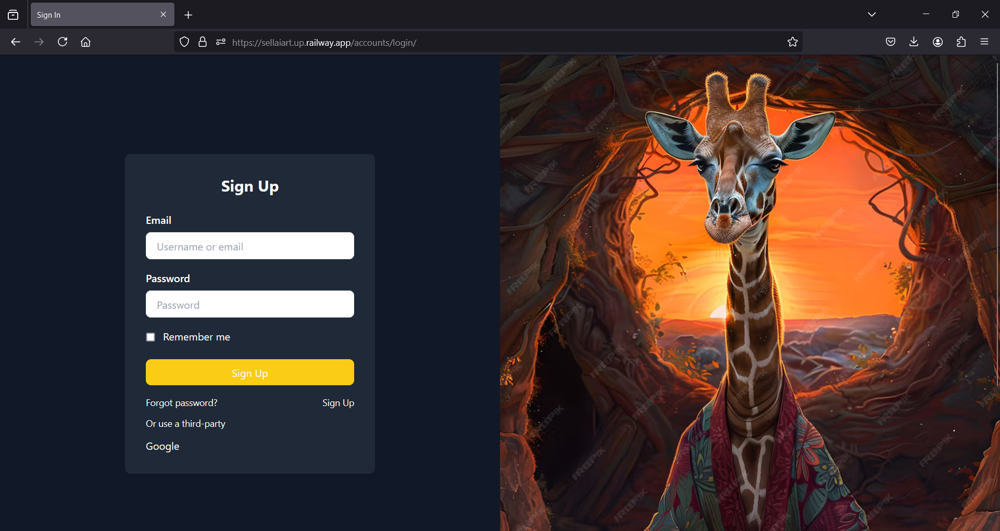
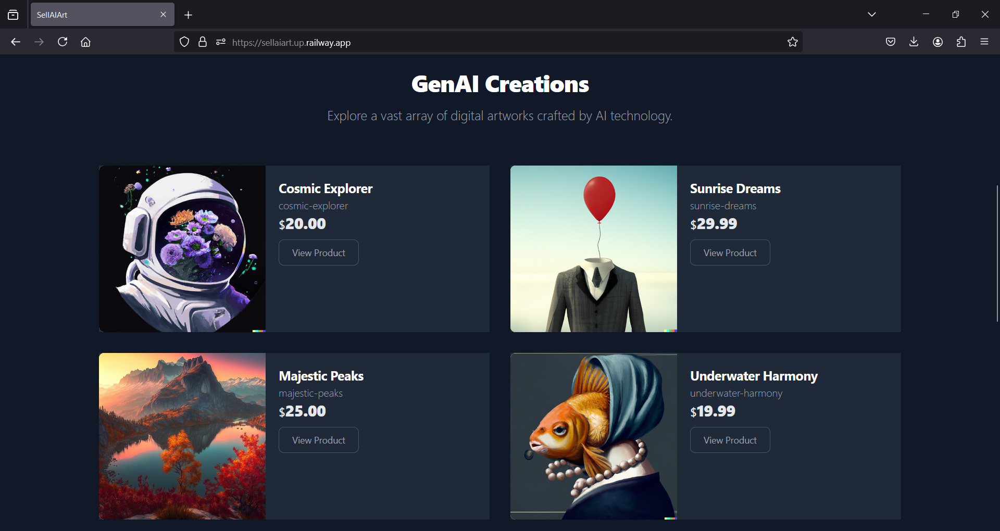
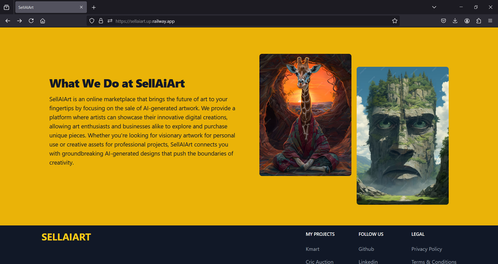
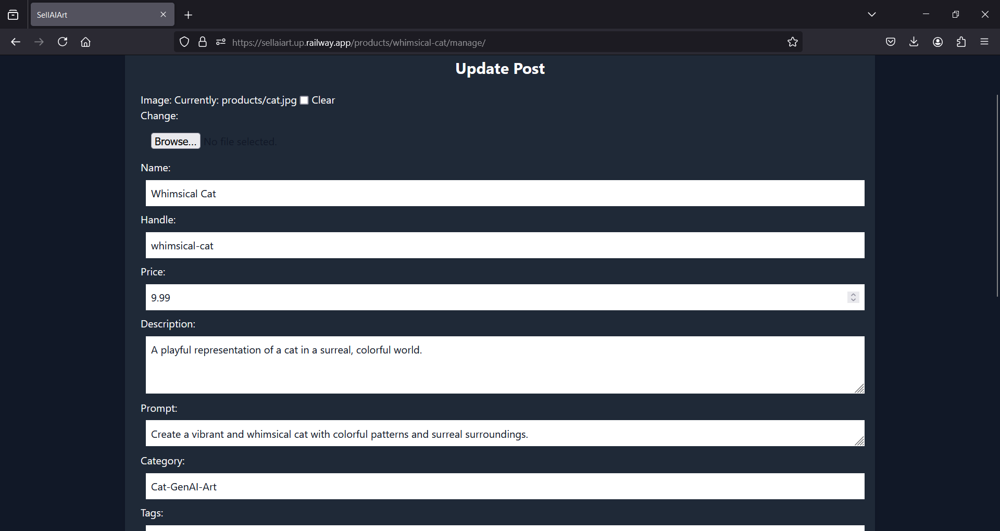

# Welcome to SellAiArt

## Project Overview
**SellAiArt** is a platform for AI artists to create, showcase, and sell their art, offering tools for art generation and a global marketplace. It empowers artists to earn income and gain recognition in the evolving AI art space, providing a secure and user-friendly environment designed for scalability.

## Motivation
As AI art becomes more popular, there is a growing need for a dedicated platform that supports AI artists. SellAiArt addresses this by offering an accessible marketplace to showcase and monetize their work, enabling artists to gain exposure and capitalize on the expanding market for AI-generated content through free and paid options.

## What It Does
SellAiArt allows AI artists to create, manage, and sell their artwork through various features:
- **Art Generation and Commercialization:** Artists can generate AI art and choose to offer it for free or sell it.
- **Secure Asset Downloads:** Provides presigned access for secure paid downloads, protecting assets for buyers.
- **User Authentication:** Supports OAuth for a seamless and secure onboarding experience.
- **Recognition and Exposure:** Helps artists reach a broader audience and earn from their work.

## Features
- **AI Art Generation Tools:** Enables artists to create and enhance AI-generated images.
- **Secure Marketplace:** Options for free and paid downloads, with secure links for paid assets.
- **OAuth Authentication:** Simplifies user authentication for a secure sign-up and login process.
- **Scalable Architecture:** Designed to support future growth alongside the user base.

## How I Built It
SellAiArt uses a robust tech stack for a quality experience:
- **Backend:** Django for secure data management.
- **Database:** PostgreSQL with NeonDB for scalability.
- **Frontend:** HTML, CSS, JavaScript, and Tailwind CSS for a responsive interface.
- **Secure File Storage:** AWS S3 for asset security, with presigned URLs for access control.
- **Authentication and Access Control:** OAuth for secure user authentication.
- **Deployment and CI/CD:** Docker and GitHub Actions for streamlined testing and deployment.

## Challenges
Building SellAiArt involved addressing critical challenges:
- **Securing Paid Assets:** Implementing presigned URLs to protect artists' work.
- **Scalable Infrastructure:** Ensuring platform performance with user and asset growth.
- **Streamlined User Authentication:** Balancing security with user experience in OAuth integration.

## What I Learned
The development process highlighted the need for robust security and scalable architecture, enhancing our skills in secure asset delivery, OAuth authentication, and CI/CD processes for consistent quality.

## What's Next for SellAiArt
SellAiArt's roadmap includes:
- **Enhanced AI Art Tools:** More options for artists to explore different styles.
- **Advanced Analytics:** Insights on sales and engagement to inform artists.
- **Subscription Options:** Exploring membership models for exclusive content.
- **Course Integration:** Creating a platform for artists to teach AI art creation.

---

## Sanpshots

Home Page

Register

Explore

About

Detail

Create/Manage

## Getting Started
To get started with SellAiArt, follow these steps:

1. Clone the repository:

2. Navigate to the project directory:

3. Install dependencies:

4. Start the development server:

5. Open your browser and visit `http://localhost:3000` to use SellAiArt.

---

Thank you for your interest in SellAiArt! We are dedicated to helping you achieve better health through personalized supplement recommendations tailored to your needs. We look forward to supporting you on your wellness journey!

