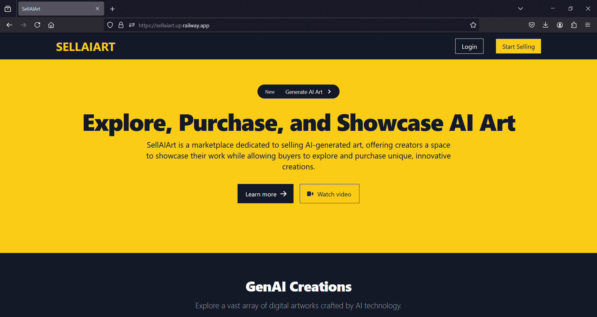

# SellAiArt Enabling AI Artists to Create and Profit

### Overview

SellAiArt is a web platform designed to empower AI artists by providing tools to generate, showcase, and sell their AI-generated artwork. It bridges the gap between artistic creativity and commerce, offering a seamless experience for artists to monetize their work.

### Motivation

Inspired by Botto, a decentralized AI artist that combines algorithmic art generation with human judgment, SellAiArt was conceived to simplify and democratize AI art creation. The platform focuses on convenience and scalability, allowing artists to focus on creativity while the platform handles storage, presentation, and transactions.

 

### Features
   - **AI Art Generation:** Create unique AI artworks using advanced models from Replicate.ai with tailored prompts for high-quality outputs.
   - **Secure Storage:** AWS S3 ensures safe and reliable storage of all generated art assets.
   - **Monetization Tools:** Integrated Stripe payments for seamless and secure transactions.
   - **Exclusive Content:** Protects assets from unauthorized downloads until purchase.

<<<<<<< HEAD
### Tech Stack
=======
## What I Learned
The development process highlighted the need for robust security and scalable architecture, enhancing our skills in secure asset delivery, OAuth authentication, and CI/CD processes for consistent quality.

## What's Next for SellAiArt
SellAiArt's roadmap includes:
- **Enhanced AI Art Tools:** More options for artists to explore different styles.
- **Advanced Analytics:** Insights on sales and engagement to inform artists.
- **Subscription Options:** Exploring membership models for exclusive content.
- **Course Integration:** Creating a platform for artists to teach AI art creation.

---

## Sanpshots

Home Page

Register

Explore

About

Detail

Create/Manage

>>>>>>> 0123ffca9829aa589bc6a801be63c3261e654e97

   - **Django Backend:** Facilitates core functionalities with Jinja templates for fast prototyping and Tailwind CSS for sleek, responsive design.
   - **Replicate.ai Integration:** Streamlines AI art creation by leveraging advanced pre-trained models.
   - **Storage & Security:** AWS S3 integration ensures secure file uploads and storage.
   - **Payment Gateway:** Stripe API integration for secure and effortless payment processing.
   - **Deployment:** CI/CD with Docker and GitHub Actions ensures a robust and scalable platform.

## Getting Started

To get started with SellAiArt, follow these steps:

1. Clone the repository:

2. Navigate to the project directory:

3. Install dependencies:

4. Start the development server:

5. Open your browser and visit `http://localhost:3000` to use SellAiArt.
